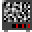
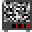

# A Quick Guide To ImageMagick

ImageMagick is a commandline application for editing images.\
I find it good for cropping and scaling images in bulk, creating animated gifs and assembling sprite sheets.\
You can even stick the commands in a script to run. My examples will output all results to the Home directory.\
I'll also mention some tips and pitfalls I've discovered.\

### Resources
First some resources.\
[The ImageMagick site](http://www.imagemagick.org)\
The [good intro](http://www.imagemagick.org/script/command-line-processing.php)\
The [bad official docs](http://www.imagemagick.org/Usage/crop/#crop_tile). These are detailed but also obsolete, misspelled, verbose and purple.

---

You can generate some builtin images to practice on
>`magick rose: rose.gif`

  

---

convert png to gif
> `convert dude.png +repage dude.gif`  

---

To crop a sprite sheet  
  
do this
> `convert bobs.gif -crop 32x32 +repage d%03d.gif`

Produces  

---

Rows

---

 

In this row I want to crop just the sprites
  

Since I know every sprites is 32px wide

> `convert ~/dude-cropped.png -crop 32x0 +repage ~/d%02d.png`

---
To put these 3 sprites in a row
    
I can target them individually
>`magick d009.gif d010.gif d011.gif +append tv1.gif`

Or I can grab a range based on filename!

>`magick d%03d.gif[9-11] +append tv1.gif`

To stack them up
>`magick d1.gif d2.gif d3.gif -append tv1.gif`

---

For offset, the origin (0,0) is upper-left corner. (w)x(h)(+right)(+down)  
The following negatively colours a (tall) area:  
First in topL corner 10px to the right, 20px down. turned a red rose blue
>`magick rose: -region '100x200+10+20' -negate rNeg1.gif`

This spills off the left edge
>`magick rose: -region '100x200-10+20' -negate rNeg2.gif`

This resets the origin (0,0) to the centre so offset is below+L of it.
>`magick rose: -gravity center -region '100x200-10+20' -negate rNeg3.gif`

dead centre
>`magick rose: -gravity center -region '100x200' -negate rNeg4.gif`

---

source  
Make a gif

> `magick d00%d.gif[0-7] bl.gif`

 

---

Tips:  
Convert to gif before cropping to see the whitespace that pngs hide.  
Output %03d cos it probably generates 100s of sprites.
I probably do want to keep the rows anyway!

